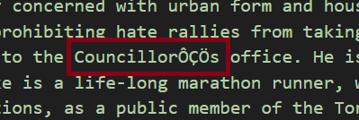
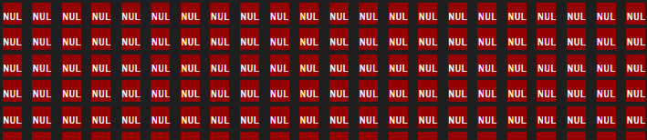

# Getting Started with BeautifulSoup

## 1. Prerequisites

- **Python version**: 3.7 or later  
- **Install packages**:
```bash
pip install requests beautifulsoup4
```

## 2. Why Use `requests`

In the last chapter we learned how HTTP works and how to craft requests. `requests` handles that for us in Python:

```python
import requests

response = requests.get("https://example.gov/parks")
response.raise_for_status()    # stops on 4xx/5xx
html = response.text
```

We need `requests` to retrieve the raw HTML before parsing it with BeautifulSoup.

## Importing & Initializing BeautifulSoup

```python
from bs4 import BeautifulSoup

# feed it your HTML and choose a parser
soup = BeautifulSoup(html, "html.parser")
```

- `"html.parser"` is built in.  
- Alternatives (`"lxml"`, `"html5lib"`) can be faster or more lenient if installed.

## Common BeautifulSoup Methods

| Method                       | Description                                    |
|------------------------------|------------------------------------------------|
| `soup.find(name, attrs)`     | First matching element                         |
| `soup.find_all(name, attrs)` | List of all matches                            |
| `soup.select(css_selector)`  | List of elements matching a CSS selector      |
| `element.get_text()`         | Extract inner text                             |
| `element.attrs`              | Dict of all attributes                         |
| `element["attr_name"]`       | Shortcut for a specific attribute (`href`, etc)|

## Example: Scraping Public Parks

Imagine a page at `https://example.gov/parks` lists parks in this structure:

```html
<div class="park-list">
    <div class="park">
        <h2>Riverside Park</h2>
        <p class="address">123 River Rd.</p>
        <p class="hours">Open: 6 AM–10 PM</p>
    </div>

    <div class="park">
        <h2>Lakeside Park</h2>
        <p class="address">123 Lake Rd.</p>
        <p class="hours">Open: 6 AM–10 PM</p>
    </div>

    <div class="park">
        <h2>Bay Park</h2>
        <p class="address">123 Bay Rd.</p>
        <p class="hours">Open: 6 AM–10 PM</p>
    </div>
</div>
```

A complete script to extract name, address, and hours from the hypothetical park example would look like this:

```python
import requests
from bs4 import BeautifulSoup
import json

BASE_URL = "https://example.gov/parks"

def scrape_parks(url):
resp = requests.get(url)
resp.raise_for_status()
soup = BeautifulSoup(resp.text, "html.parser")

parks = []
for div in soup.find_all("div", class_="park"):
    name    = div.find("h2").get_text(strip=True)
    address = div.find("p", class_="address").get_text(strip=True)
    hours   = div.find("p", class_="hours").get_text(strip=True)
    parks.append({"name": name, "address": address, "hours": hours})

return parks

def save_json(data, path="parks.json"):
with open(path, "w", encoding="utf-8") as f:
    json.dump(data, f, indent=2, ensure_ascii=False)

if __name__ == "__main__":
data = scrape_parks(BASE_URL)
save_json(data)
```

- **`resp.raise_for_status()`** stops on HTTP errors.  
- We combine `find_all`, `find`, and `get_text()` for clean extraction.

## Unique & Advanced BeautifulSoup Features

Beyond basic searching and text extraction, BeautifulSoup offers powerful tools for navigating, filtering, and even modifying the parse tree.

### Navigating the Tree

- **`.parent` / `.parents`**  
    ```python
    tag = soup.find("span", class_="price")
    container = tag.parent            # direct parent
    for ancestor in tag.parents:      # walk up all ancestors
        print(ancestor.name)
    ```
- **`.next_sibling` / `.previous_sibling`**  
    ```python
    first = soup.find("h2")
    second = first.next_sibling       # might be a newline—use .find_next_sibling()
    second_heading = first.find_next_sibling("h2")
    ```
- **`.find_next()` / `.find_previous()`**  
    ```python
    # Find the next <p> after a header
    header = soup.find("h1")
    p = header.find_next("p")

    # Or in cases where there are multiple <p>
    section_paragraphs = []

    while p:
        section_paragraphs.append(p.get_text(strip=True))
        # move to the next sibling <p>; stops when next tag isn’t <p>
        p = p.find_next_sibling("p")

    # full section text is appended to section_paragraph list
    ```

### Encoding
After compiling a collection (be it in csv, txt, or other format) of data, it is important to do a thourough check for encoding errors. Even if you declare utf-8 encoding in the save statement, you may still find characters like this in the output:



or a more extreme example, where every character is 'corrupted':




In most cases, this is either due to the file being opened with a non utf-8 encoding in your text editor - Visual Studio Code or a sheet editor like Excel, or due to an improper encoding declaration when saving the file in the script.

[Visual Studio Code – File encoding support](https://code.visualstudio.com/docs/editor/codebasics#_file-encoding-support)

[Microsoft Excel – Save a workbook to text format (CSV UTF‑8)](https://support.microsoft.com/en-us/office/save-a-workbook-to-text-format-txt-or-csv-3e9a9d6c-70da-4255-aa28-fcacf1f081e6)

Once you've determined that the file is correctly encoded, you may notice (or be alerted of) the presence of non-text unicode - invisible instructions to compose the text on page. Regex is especially helpful for finding and replacing nontext - but how do you know what to replace?

[Check for non-ASCII characters here, or in your text editor if supported](https://pages.cs.wisc.edu/~markm/ascii.html)

Then, determine the best course of action for replacing it - this likely means contacting your project manager and providing a detailed report on what you've found.

If you are tasked with removing specific nontext, ReGex is especially helpful in doing so:

```python
import re
import regex

text = "Some\u200Btext\x00with\uFEFFinvisible\u200Cchars\x1Fand other\u2060weird\u200Dstuff."

# Four common methods, each changing different characters depending on what you need 

# 1. Replace zero‑width & BOM characters with a space
clean1 = re.sub(r'[\u200B\u200C\u200D\uFEFF]', ' ', text)

# 2. Replace ASCII control characters (0x00–0x1F, 0x7F) with a space, likely the correct choice here
clean2 = re.sub(r'[\x00-\x1F\x7F]', ' ', clean1)

# 3. Remove ASCII control characters entirely
clean3 = re.sub(r'[\x00-\x1F\x7F]', '', clean1)

# 4. Remove all invisible/non‑text Unicode (any “Other” category)
clean4 = regex.sub(r'\p{C}+', '', text)
```

**Output**
```
1: Some textwith invisible charsand other⁠weird stuff.
2: Some text with invisible chars and other⁠weird stuff.
3: Some textwith invisible charsand other⁠weird stuff.
4: Sometextwithinvisiblecharsand otherweirdstuff.
```

### Filtering & Search Strategies

- **`SoupStrainer`** (parse‑time filtering)  
    ```python
    from bs4 import SoupStrainer
    only_links = SoupStrainer("a")
    soup = BeautifulSoup(html, "lxml", parse_only=only_links)
    ```

### Modifying the Tree

- **Creating new tags & strings**  
    ```python
    new_div = soup.new_tag("div", **{"class": "note"})
    new_div.string = "This is a generated note."
    ```
- **Inserting & replacing**  
    ```python
    target = soup.find(id="main-content")
    target.insert_after(new_div)
    old_tag.replace_with(new_div)
    ```
- **Removing content**  
    ```python
    ad = soup.find("div", class_="advertisement")
    ad.decompose()    # remove tag and contents
    comment.extract() # remove but keep the Comment object
    ```
- **Unwrapping vs extracting**  
    ```python
    # Remove tag but keep its children
    wrapper = soup.find("span", class_="wrapper")
    wrapper.unwrap()
    ```

### Working with Text

- **`.stripped_strings`**  
    ```python
    for text in soup.get_text(strip=True).split():
        print(text)
    # or, per-element:
    for piece in tag.stripped_strings:
        print(piece)
    ```
- **`.get_text(separator="|")`**  
Control how nested text is joined:
    ```python
    all_text = tag.get_text(separator=" | ")
    ```

### Output & Encoding

    - **`.prettify()`**  
    ```python
    print(soup.prettify())
    ```
- **`.encode()` / `.decode()`**  
    ```python
    html_bytes = soup.encode("utf-8")
    html_unicode = html_bytes.decode("utf-8")
    ```

### Parser Choices

- **`"html.parser"`**: built‑in, no extra install.  
- **`"lxml"`**: very fast, requires `lxml` library.  
- **`"html5lib"`**: most forgiving, creates valid HTML5 tree.

    ```python
    soup         = BeautifulSoup(html, "html.parser")
    soup_lxml    = BeautifulSoup(html, "lxml")
    soup_html5   = BeautifulSoup(html, "html5lib")
    ```

---

For the full API reference and additional recipes, see the official docs:  
<https://www.crummy.com/software/BeautifulSoup/bs4/doc/>  